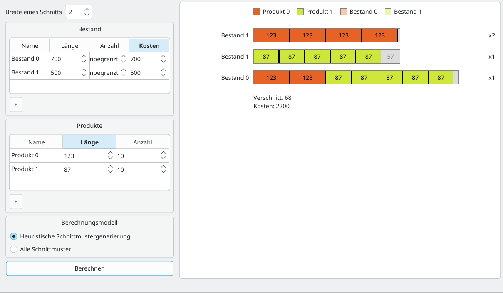

# Stockcutting

A Qt desktop application that solves the one-dimensional cutting stock problem and visualizes the resulting cutting plan.



## Overview

Given a set of products with defined lengths and demands, and a set of stock types (length, cost, availability), the application computes cutting patterns – combinations of products that fit into a single stock piece with respect to a saw width – that satisfy all demands at minimal cost.

The GUI lets you enter products and stocks directly, pick a solver strategy, and renders the resulting cutting plan as colored bars showing products, waste and the usage count per stock piece.

## Features

- Table-based input for products (name, length, demand) and stock types (name, length, amount, cost)
- Optional saw width to account for the material lost per cut
- Unlimited stock availability support
- Two solver strategies (see below)
- Visual cutting plan with per-product legend, waste and total cost
- German and English UI (via Qt translations)

## Solvers

Both strategies are based on the Gilmore–Gomory LP formulation and use [GLPK](https://www.gnu.org/software/glpk/):

- **Heuristic Column Generation** – starts from a trivial pattern set and iteratively improves it by solving an integer knapsack subproblem with the dual prices of the current LP relaxation. Fast and suitable for large instances.
- **All Cutting Patterns** – enumerates every feasible pattern per stock type and solves the resulting LP/IP directly. Only practical for small instances.

Both derive from the `StockCuttingSolver` base class and return a list of `PatternUsage` (pattern plus usage quantity).

## Build

### Dependencies

- CMake >= 3.16
- C++17 compiler
- Qt 5 or Qt 6 (Widgets, LinguistTools)
- G* (cuts > 0 ? cuts - LPK

### Ubuntu/Debian

```bash
sudo apt install cmake g++ qt6-base-dev libglpk-dev
```

### Configure and build

```bash
cmake -S . -B build
cmake --build build
```

Run the application:

```bash
./build/Stockcutting
```

## Usage

Enter products and stock types in the tables (use the `+` buttons to add rows, a negative amount means unlimited stock), set the saw width, select a calculation model and click **Calculate**. The resulting cutting plan is displayed on the right.

To use the solvers programmatically:

```cpp
std::vector<Product> products = {{.name = "P1", .length = 160, .demand = 6},
                                 {.name = "P2", .length = 480, .demand = 7},
                                 {.name = "P3", .length = 735, .demand = 4}};

std::vector<StockType> stocks = {{.name = "S1", .length = 2400, .cost = 1, .availabilty = -1},
                                 {.name = "S2", .length = 2880, .cost = 1, .availabilty = -1}};

HeuristicColumnGeneration solver(products, stocks);
std::vector<PatternUsage> result = solver.solve();
```

## License

[MIT](LICENSE)
